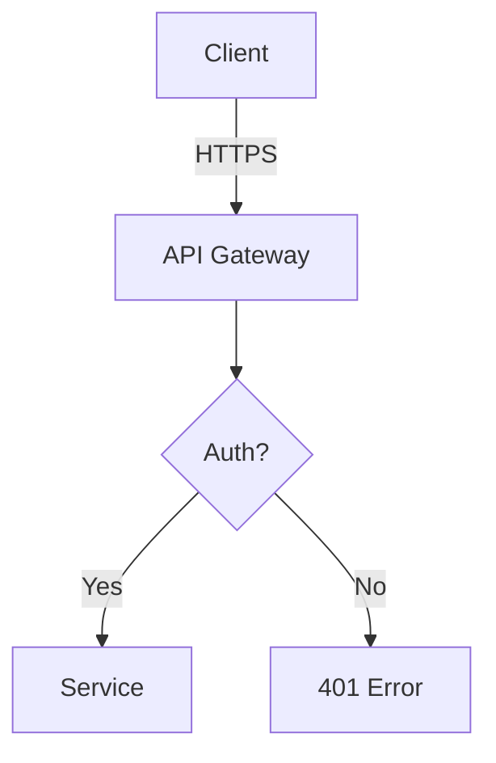

# DevFlow Documentation Standards

This file defines standards for all DevFlow documentation to ensure consistency and quality.

## Architecture.md Structure

### Required Sections

```markdown
# Project Architecture

## Overview
Brief description of the system (2-3 paragraphs)

## Technology Stack
- Frontend: [framework, libraries]
- Backend: [language, framework]
- Database: [type, version]
- Infrastructure: [hosting, services]
- Tools: [build, test, deploy]

## System Components

### [Component Name]
- **Purpose:** What it does
- **Technology:** What it's built with
- **Dependencies:** What it depends on
- **Location:** File path or service URL

## Data Models

### [Model Name]
```
[Schema definition or description]
```
- **Relations:** How it relates to other models
- **Indexes:** Performance optimizations
- **Constraints:** Business rules

## API Design

### [Endpoint Group]

#### [HTTP METHOD] /path/to/endpoint
- **Purpose:** What it does
- **Auth:** Required authentication
- **Request:**  [schema or example]
- **Response:** [schema or example]
- **Errors:** Possible error codes

## Cross-Cutting Concerns

### Authentication
[How auth works]

### Authorization
[How permissions work]

### Error Handling
[Error strategy]

### Logging & Monitoring
[Observability approach]

## Architectural Decisions

### [Decision Name] - [Date]
- **Context:** Why this decision was needed
- **Options:** What was considered
- **Decision:** What was chosen
- **Rationale:** Why it was chosen
- **Consequences:** Trade-offs and implications
```

## Implementation Log Format

### Structure

```markdown
# Implementation Log - [Feature Name]

## [Date] - [Phase]

### Task [N]: [Task Description]
**Status:** [In Progress | Complete | Blocked]
**Time:** [Duration]

**Changes:**
- [File path]: [Description of change]
- [File path]: [Description of change]

**Decisions:**
- [Decision made and why]

**Issues Encountered:**
- [Problem description]
  - Solution: [How it was resolved]

**Notes:**
[Any additional context or observations]

---
```

### Example Entry

```markdown
## 2025-10-26 - EXECUTE Phase

### Task 3.2: Implement Password Hashing
**Status:** Complete
**Time:** 1.5 hours

**Changes:**
- Models/User.cs: Added PasswordHash and PasswordSalt properties
- Services/AuthService.cs: Implemented bcrypt hashing in CreateUser and ValidatePassword
- Tests/AuthServiceTests.cs: Added unit tests for password hashing

**Decisions:**
- Chose bcrypt over PBKDF2 for better resistance to GPU cracking
- Set work factor to 12 (recommended for 2025)

**Issues Encountered:**
- Initial NuGet package (BCrypt) was deprecated
  - Solution: Switched to BCrypt.Net-Next (actively maintained)

**Notes:**
Existing passwords will need migration script. Tracked in task 3.3.

---
```

## Retrospective Template

```markdown
# Retrospective - [Feature Name]

**Feature:** [Display name]
**Key:** [yyyymmdd-feature-slug]
**Completed:** [Date]
**Duration:** [X days/weeks]

## Summary

[2-3 paragraph summary of what was accomplished and overall experience]

## Metrics

- **Tasks Completed:** X/X
- **Time Estimated:** X hours
- **Time Actual:** X hours
- **Variance:** +/- X%
- **Files Changed:** X
- **Lines Added:** X
- **Lines Removed:** X

## What Went Well

1. **[Success 1]**
   [Description and why it went well]

2. **[Success 2]**
   [Description and why it went well]

3. **[Success 3]**
   [Description and why it went well]

## Challenges

1. **[Challenge 1]**
   - **Impact:** [How it affected progress]
   - **Resolution:** [How it was overcome]
   - **Prevention:** [How to avoid in future]

2. **[Challenge 2]**
   - **Impact:** [How it affected progress]
   - **Resolution:** [How it was overcome]
   - **Prevention:** [How to avoid in future]

## Lessons Learned

1. **[Lesson 1]**
   [What was learned and how to apply it]

2. **[Lesson 2]**
   [What was learned and how to apply it]

3. **[Lesson 3]**
   [What was learned and how to apply it]

## Recommendations

### For Similar Features
- [Recommendation 1]
- [Recommendation 2]

### For Process Improvements
- [Recommendation 1]
- [Recommendation 2]

### For Architecture
- [Recommendation 1]
- [Recommendation 2]

## Technical Debt

[Any technical debt introduced that needs future attention]

## Follow-up Items

- [ ] [Item 1]
- [ ] [Item 2]
- [ ] [Item 3]
```

## Writing Style Guidelines

### Voice and Tone
- **Active voice:** "AuthService validates credentials" not "Credentials are validated"
- **Present tense:** "Service handles requests" not "Service will handle"
- **Direct:** Avoid unnecessary words
- **Objective:** Facts over opinions

### Formatting

**Code References:**
- Use backticks: `ClassName`, `methodName()`, `variable`
- File paths: `src/Services/AuthService.cs`
- Full paths when ambiguous: `backend/src/Services/AuthService.cs`

**Emphasis:**
- **Bold** for key concepts and important points
- *Italic* for introducing technical terms first time
- `Code formatting` for all code elements

**Lists:**
- Use unordered (`-`) for non-sequential items
- Use ordered (`1.`) for steps or rankings
- Keep items parallel in structure

**Headings:**
- Use sentence case: "User authentication" not "User Authentication"
- Be specific: "OAuth 2.0 flow" not "Login system"
- Avoid generic: Use "Payment processing" not "Processing"

### Content Guidelines

**Include:**
- Rationale for decisions
- Trade-offs considered
- Alternative approaches evaluated
- Dependencies and relationships
- Performance implications
- Security considerations
- Example usage when helpful

**Exclude:**
- Implementation details better left in code
- Temporary states ("we plan to...")
- Personal opinions without backing
- Duplicated information
- Obvious information
- Implementation that changes frequently

### Diagram Guidelines

Use ASCII diagrams for simple flows:
```
[Client] --> [API] --> [Service] --> [Database]
```

Use Mermaid for complex flows:
````markdown

````

## Update Triggers

### Automatic Updates
Documentation should be automatically updated when:
- New files/classes/services created
- Data models changed
- API contracts modified
- Dependencies added/removed
- Configuration changed

### Manual Review Needed
Require human review for:
- Architectural decisions
- Trade-off explanations
- Security implications
- Performance characteristics
- Deprecation notices

## Version Control

### Commit Messages for Docs
```
docs(architecture): add OAuth service documentation
docs(implementation): log task 3.2 completion
docs(retrospective): generate for user-auth feature
```

### When to Update
- **Architecture:** After significant code changes
- **Implementation Log:** During/immediately after work
- **Retrospective:** At feature completion

## Quality Checklist

Before considering documentation complete:

**Architecture.md:**
- [ ] All components documented
- [ ] Data models include schemas
- [ ] API endpoints have request/response examples
- [ ] Technology stack is current
- [ ] Architectural decisions include rationale
- [ ] Cross-cutting concerns addressed
- [ ] No outdated information

**Implementation Log:**
- [ ] Chronological order maintained
- [ ] All tasks logged
- [ ] Decisions documented with rationale
- [ ] Issues and resolutions recorded
- [ ] File changes listed
- [ ] Timestamps present

**Retrospective:**
- [ ] Metrics included
- [ ] Honest assessment (good and bad)
- [ ] Lessons learned are actionable
- [ ] Recommendations are specific
- [ ] Technical debt documented
- [ ] Follow-up items tracked
